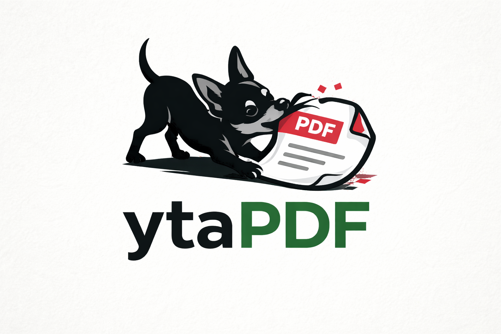
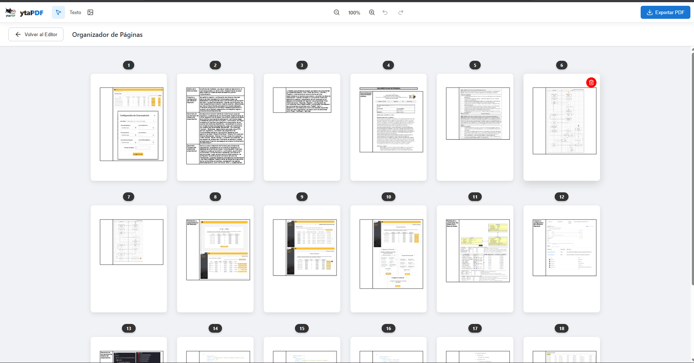

<div align="center">
  

  # ytaPDF - Editor PDF Web Avanzado

  [](https://ytapdf.vercel.app/)
  [](https://svelte.dev/)
  [](https://www.typescriptlang.org/)
  [](http://fabricjs.com/)

  *Una herramienta potente y fluida para visualizar, organizar, modificar y exportar documentos PDF con máxima precisión directamente desde tu navegador.*

  **[Visitar Aplicación en Vivo](https://ytapdf.vercel.app/)**
</div>

---

## Descripción General

**ytaPDF** es un editor de PDF web de alto rendimiento diseñado para proporcionar una experiencia de gestión de documentos fluida y eficiente. Construido en su totalidad con tecnologías web modernas, la aplicación ofrece herramientas avanzadas para trabajar con tus documentos PDF de manera local en tu navegador, garantizando privacidad y velocidad.

La arquitectura de ytaPDF está diseñada con un fuerte enfoque en la modularidad, la gestión eficiente de la memoria y velocidades de renderizado excepcionales, asegurando un funcionamiento óptimo incluso con documentos de gran tamaño.

## Características Principales

* **Renderizado Avanzado:** Utiliza [PDF.js](https://mozilla.github.io/pdf.js/) para una visualización ultra precisa y rápida de los documentos.
* **Exportación de Alta Precisión:** Impulsado por [pdf-lib](https://pdf-lib.js.org/), genera PDFs manteniendo coordenadas exactas, rotación, escalado de imágenes y preservando el formato de texto (negritas, cursivas) de manera idéntica a lo que ves en el editor visual.
* **Organizador Intuitivo:** Interfaz de cuadrícula interactiva con la funcionalidad de arrastrar y soltar (Drag & Drop) para reordenar, fusionar y gestionar páginas de múltiples archivos PDF con facilidad.
* **Edición Visual:** Capa de edición interactiva potenciada por **Fabric.js v7**, permitiendo realizar anotaciones, añadir imágenes y textos con control milimétrico.
* **Diseño 100% Responsivo:** Interfaz adaptable a cualquier tamaño de pantalla (móvil, tablet y escritorio). Gestiona y edita tus documentos cómodamente desde cualquier dispositivo.
* **Alto Rendimiento:** Implementa carga diferida (lazy loading), uso eficiente de canvas y gestión optimizada para manejar tareas complejas sin bloquear el hilo principal.

## Pila Tecnológica

| Categoría | Tecnología | Función |
| :--- | :--- | :--- |
| **Framework Frontend** | Svelte 5 | Interfaz de usuario reactiva y eficiente |
| **Tipado** | TypeScript | Seguridad de tipos y mejor experiencia de desarrollo |
| **Manipulación Visual**| Fabric.js v7 | Motor de canvas para edición visual, dibujo y texto |
| **Procesamiento PDF** | PDF.js | Interpretación y renderizado de archivos PDF |
| **Generación PDF** | pdf-lib | Creación y manipulación a bajo nivel de documentos PDF |
| **Bundler** | Vite | Entorno de desarrollo ultrarrápido y construcción optimizada |

## Despliegue

La aplicación se encuentra desplegada y lista para usar en Vercel:

**Enlace Oficial:** [https://ytapdf.vercel.app/](https://ytapdf.vercel.app/)

## Configuración e Instalación Local

Si deseas ejecutar ytaPDF de manera local para desarrollo o uso personal, sigue estos pasos:

### Requisitos Previos

* Node.js (se recomienda la versión 18 o superior)
* Gestor de paquetes npm, pnpm o yarn

### Pasos de Instalación

1. **Clonar el repositorio:**
   ```bash
   git clone <url-del-repositorio>
   cd ytaPDF
   ```

2. **Instalar dependencias:**
   ```bash
   npm install
   ```

3. **Iniciar el servidor de desarrollo:**
   ```bash
   npm run dev
   ```
   La aplicación estará disponible típicamente en `http://localhost:5173`.

4. **Compilar para producción:**
   ```bash
   npm run build
   ```

## Vistas Previas

<div align="center">
  
  
  
</div>
