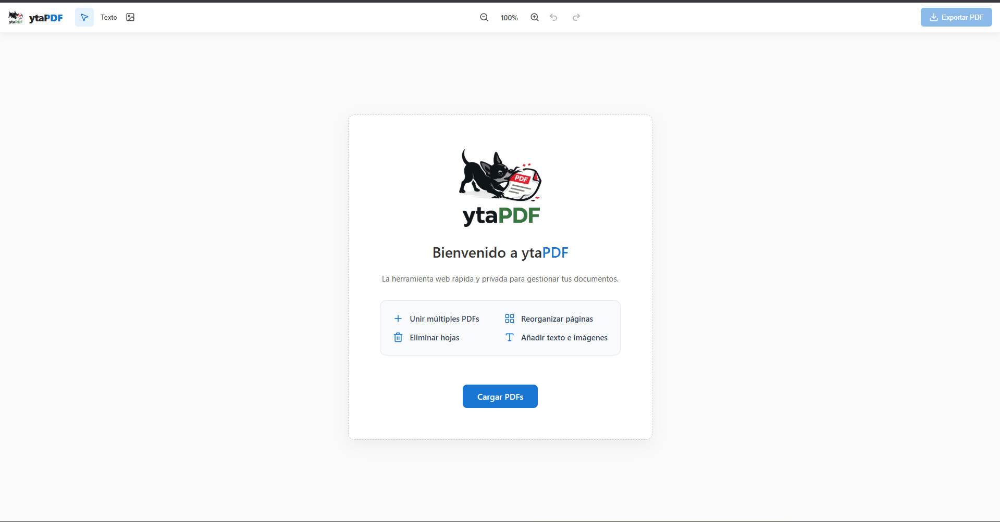
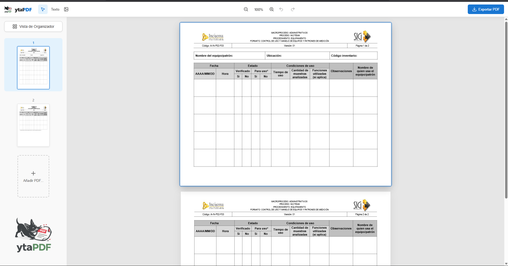

# ytaPDF - Editor PDF Web

<div align="center">
  
</div>

## Descripción General

ytaPDF es un editor de PDF web de alto rendimiento diseñado para proporcionar una experiencia de gestión de documentos fluida y eficiente. Construida en su totalidad con Svelte, PDF.js y Fabric.js, la aplicación ofrece herramientas potentes para visualizar, organizar y modificar documentos PDF directamente desde el navegador.

La arquitectura está diseñada con un enfoque en la modularidad, la gestión eficiente de la memoria y la velocidad de renderizado, asegurando un funcionamiento óptimo incluso con documentos de gran tamaño.

## Características Principales

* **Renderizado Avanzado de PDF:** Utiliza PDF.js para una visualización precisa y rápida de los documentos.
* **Organizador de Documentos:** Cuenta con una interfaz de cuadrícula con funcionalidad de arrastrar y soltar para reordenar, fusionar y gestionar páginas de uno o varios archivos PDF de manera intuitiva.
* **Edición sobre el Documento:** Capa de edición interactiva impulsada por Fabric.js, que permite realizar anotaciones y modificaciones precisas.
* **Desplazamiento Continuo y Miniaturas:** Proporciona una navegación fluida a través de las páginas con retroalimentación visual instantánea y sincronización de desplazamiento.
* **Alto Rendimiento:** Implementa carga diferida (lazy loading), uso eficiente de canvas y diseño responsivo para manejar tareas complejas.

## Pila Tecnológica

* **Framework Frontend:** Svelte
* **Procesamiento PDF:** PDF.js
* **Manipulación de Canvas:** Fabric.js
* **Empaquetador:** Vite
* **Lenguaje:** TypeScript

## Configuración e Instalación

### Requisitos Previos

* Node.js (se recomienda la versión 16 o superior)
* Gestor de paquetes npm o yarn

### Pasos de Instalación

1. Clonar el repositorio en el entorno local.
2. Navegar al directorio raíz del proyecto.
3. Instalar dependencias requeridas:

```bash
npm install
```

4. Iniciar el servidor de desarrollo:

```bash
npm run dev
```

## Vistas Previas



