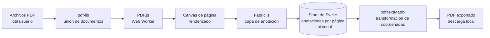

<div align="center">


# ytaPDF

**Editor de PDF que funciona íntegramente en el navegador.**

Une, reorganiza y anota documentos con texto e imágenes, y expórtalos conservando la posición exacta de cada elemento. Ningún archivo sale de tu equipo.

<br/>

[](https://svelte.dev/)
[](https://www.typescriptlang.org/)
[](https://vite.dev/)
[](https://ytapdf.vercel.app/)


<br/>

**[ytapdf.vercel.app](https://ytapdf.vercel.app/)**

<br/>

[Características](#características) &nbsp;·&nbsp;
[El problema técnico](#el-problema-técnico) &nbsp;·&nbsp;
[Arquitectura](#arquitectura) &nbsp;·&nbsp;
[Instalación](#instalación) &nbsp;·&nbsp;
[Limitaciones](#limitaciones-conocidas)

</div>

---

## Sobre el proyecto

Editar un PDF suele implicar subirlo a un servidor ajeno. Para un contrato, una historia clínica o una declaración de renta, eso es un problema que ninguna política de privacidad resuelve del todo.

**ytaPDF** no tiene servidor. El documento se abre, se edita y se exporta dentro del navegador: no hay carga de archivos, no hay cuenta de usuario y no hay nada que borrar después. El despliegue en Vercel sirve archivos estáticos y nada más.

La contrapartida de trabajar sin backend es que toda la manipulación del PDF —incluido el cálculo de dónde va cada elemento en el documento final— ocurre en el cliente. La sección [El problema técnico](#el-problema-técnico) explica la parte menos evidente de eso.

<div align="center">

<br/><br/>

<br/><br/>

</div>

---

## Características

| | |
|---|---|
| **Unión de documentos** | Carga varios PDF a la vez y trabájalos como uno solo. Las páginas se copian con `pdf-lib` preservando su contenido original. |
| **Organizador visual** | Vista de cuadrícula con arrastrar y soltar para reordenar páginas, y eliminación con confirmación previa. |
| **Anotación con texto** | Texto sobre cualquier página con control de fuente, tamaño, color, negrita, cursiva y subrayado. |
| **Inserción de imágenes** | Imágenes PNG y JPG con escalado, rotación, volteo horizontal y vertical, y opacidad. |
| **Historial** | Deshacer y rehacer sobre el conjunto de anotaciones del documento. |
| **Exportación fiel** | El PDF resultante coloca cada elemento en la posición, el ángulo y la escala exactos que tenía en el editor. |
| **Interfaz adaptativa** | Barra lateral colapsable y controles reorganizados para pantallas pequeñas. |
| **Procesamiento local** | Ningún archivo se transmite. La aplicación funciona igual con la pestaña desconectada de la red. |

---

## El problema técnico

Lo que hace no trivial a un editor visual de PDF es que el lienzo de edición y el documento final usan sistemas de coordenadas distintos, y hay que traducir entre ellos sin pérdida.

| | Lienzo (Fabric.js) | Documento (PDF) |
|---|---|---|
| **Origen** | Esquina superior izquierda | Esquina inferior izquierda |
| **Eje Y** | Crece hacia abajo | Crece hacia arriba |
| **Unidad** | Píxeles del viewport renderizado | Puntos tipográficos |
| **Ancla del texto** | Caja de línea, con relleno según `lineHeight` | Línea base de la fuente |
| **Origen de página** | Siempre en cero | Desplazado por el `CropBox` |

`src/lib/pdfTextMatrix.ts` resuelve la conversión componiendo matrices de transformación sobre el flujo de contenido del PDF: traslación al centro del objeto, rotación combinada del objeto y de la página, y escalado con signo para los volteos. Trabajar con matrices en lugar de recalcular coordenadas evita que los errores se acumulen al encadenar transformaciones.

El caso más delicado es el texto. Fabric posiciona una caja cuya altura depende del `lineHeight`, mientras que `pdf-lib` dibuja desde la línea base. Situar el texto correctamente exige leer las métricas reales de la fuente incrustada —ascendente y descendente— y derivar de ahí el desplazamiento de la línea base respecto al borde superior de la caja:

```ts
const actualAscent = (ascent / (ascent - descent)) * fontSize;
const topPadding   = (fontSize * lineHeight - fontSize) / 2;
const baselineOffsetFromTop = actualAscent + topPadding;
```

Sin este cálculo el texto se desplaza verticalmente de forma proporcional al tamaño de fuente, un desfase que pasa desapercibido en cuerpos pequeños y se vuelve evidente en títulos.

También se contempla el `CropBox`: muchos PDF —los generados por escáneres, sobre todo— tienen un área visible desplazada respecto al origen del medio. Ignorarlo produce anotaciones correctamente alineadas en pantalla y desplazadas en el archivo exportado.

---

## Arquitectura


```mermaid
flowchart LR
    IN["Archivos PDF<br/>del usuario"] --> LIB["pdf-lib<br/>unión de documentos"]
    LIB --> JS["PDF.js<br/>Web Worker"]
    JS --> CV["Canvas de página<br/>renderizado"]
    CV --> FAB["Fabric.js<br/>capa de anotación"]
    FAB --> ST[("Store de Svelte<br/>anotaciones por página<br/>+ historial")]
    ST --> EXP["pdfTextMatrix<br/>transformación de coordenadas"]
    EXP --> OUT["PDF exportado<br/>descarga local"]
```

El renderizado corre en el *web worker* de PDF.js, de modo que abrir documentos extensos no congela la interfaz. Las páginas se dibujan bajo demanda mediante `IntersectionObserver`: solo se renderiza lo que entra en el viewport.

Las anotaciones se guardan como JSON de Fabric por página, junto con las dimensiones del viewport en que se crearon. Ese segundo dato es el que permite reconstruir la proporción correcta en la exportación aunque el usuario haya cambiado el nivel de zoom entretanto.

<details>
<summary><b>Organización del código fuente</b></summary>

<br/>

```
src/
├── App.svelte                  # Carga, unión y exportación de documentos
├── main.ts                     # Punto de montaje
└── lib/
    ├── store.ts                 # Estado global tipado y pila de historial
    ├── pdfTextMatrix.ts         # Transformación de coordenadas lienzo → PDF
    └── components/
        ├── Toolbar.svelte       # Herramientas, estilos de texto, zoom, exportación
        ├── Sidebar.svelte       # Miniaturas y navegación entre páginas
        ├── Workspace.svelte     # Viewport con renderizado diferido
        ├── PdfPage.svelte       # Página: canvas de PDF.js + lienzo de Fabric
        ├── GridOrganizer.svelte # Cuadrícula con arrastrar y soltar
        └── ConfirmModal.svelte  # Confirmación de acciones destructivas
```

</details>

---

## Stack técnico

| Capa | Tecnología | Función |
|---|---|---|
| Framework | Svelte 5 | Interfaz reactiva con runas |
| Lenguaje | TypeScript 5.9 | Tipado del estado y de las transformaciones |
| Empaquetador | Vite 7 | Desarrollo y compilación |
| Lectura de PDF | PDF.js 5.4 | Interpretación y renderizado en worker |
| Escritura de PDF | pdf-lib 1.17 | Unión de documentos y operadores de contenido |
| Edición visual | Fabric.js 7 | Capa de objetos sobre el canvas |
| Iconografía | lucide-svelte | Iconos de la interfaz |
| Hosting | Vercel | Sitio estático |

---

## Instalación

```bash
git clone https://github.com/juanitomanoplateada/ytaPDF.git
cd ytaPDF
npm install
npm run dev
```

Disponible en `http://localhost:5173`.

| Comando | Acción |
|---|---|
| `npm run dev` | Servidor de desarrollo |
| `npm run build` | Compilado de producción en `dist/` |
| `npm run preview` | Previsualización del compilado |
| `npm run check` | Verificación de tipos con `svelte-check` |

**Requisitos:** Node.js 20.19 o superior (22.12+ recomendado), exigido por Vite 7.

---

## Limitaciones conocidas

Documentadas de forma explícita porque afectan al resultado exportado:

- **Fuentes.** La exportación usa las fuentes estándar del formato PDF —Helvetica, Times y Courier con sus variantes— que todo lector reconoce sin incrustarlas. Esto mantiene el archivo ligero y evita cuestiones de licenciamiento tipográfico, pero limita la selección disponible a esas tres familias.
- **Juego de caracteres.** Las fuentes estándar usan codificación WinAnsi. Cubre el español completo, incluidos acentos y eñes, pero no alfabetos no latinos ni emoji.
- **Documentos protegidos.** Los PDF cifrados se abren ignorando la protección cuando el formato lo permite; los que exigen contraseña para descifrar el contenido no se pueden procesar.
- **Anotaciones y edición del contenido original.** Las anotaciones se dibujan sobre el documento; el texto ya existente en el PDF no es editable ni se elimina.
- **Fuentes estándar remotas.** PDF.js descarga las métricas de fuentes estándar desde un CDN al abrir ciertos documentos. Es la única petición externa de la aplicación y no involucra el contenido del archivo.

---

## Hoja de ruta

- [ ] Herramienta de firma manuscrita sobre el documento
- [ ] Incrustación de fuentes personalizadas para ampliar la tipografía disponible
- [ ] Rotación de páginas desde el organizador
- [ ] Extracción de páginas a un documento nuevo
- [ ] Metaetiquetas de descripción y previsualización social, e idioma del documento en español
- [ ] Apertura de documentos protegidos mediante contraseña provista por el usuario

---

## Licencia

Pendiente de definir. Hasta entonces, todos los derechos reservados.

---

<div align="center">

<sub>Los documentos se procesan en tu navegador. No se transmiten ni se almacenan.</sub>

</div>
