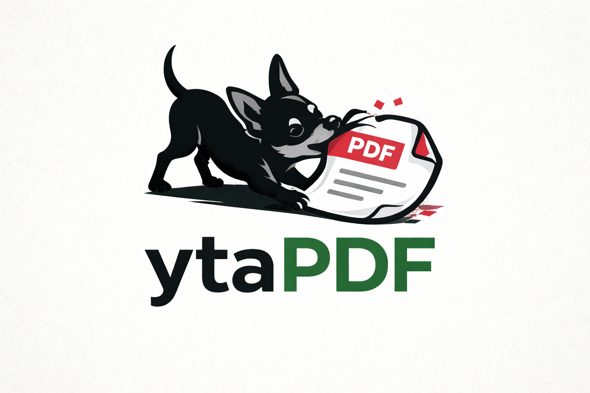
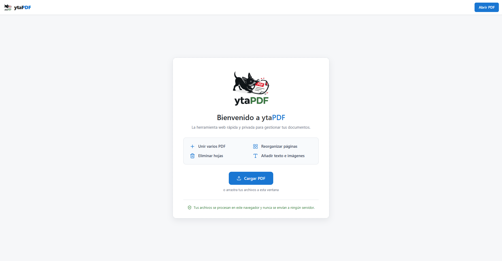
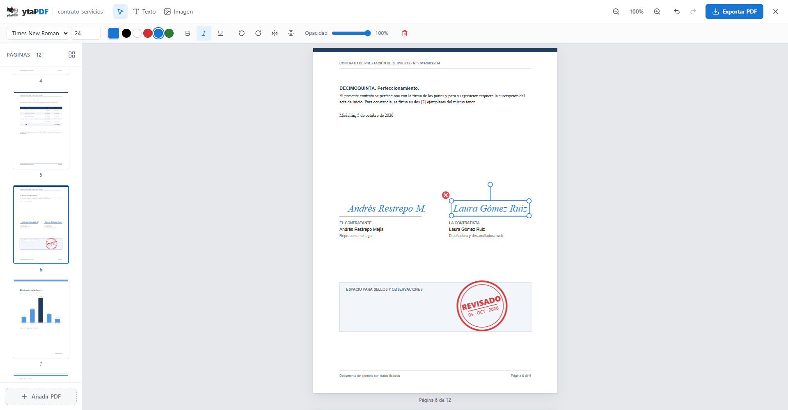
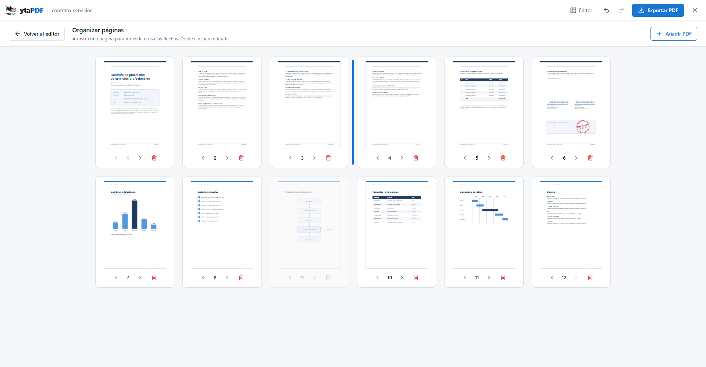
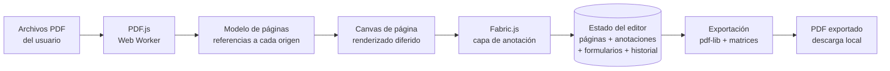

<div align="center">



# ytaPDF

**Editor de PDF que funciona íntegramente en el navegador.**

Une, organiza, firma, rellena y anota documentos con texto, imágenes y formas, **edita el texto que ya trae el PDF** con su propia fuente, y expórtalos conservando la posición exacta de cada elemento. Ningún archivo sale de tu equipo, y funciona incluso sin conexión.

<br/>

[](https://svelte.dev/)
[](https://www.typescriptlang.org/)
[](https://vite.dev/)
[](https://ytapdf.vercel.app/)


-2.11-009688?style=flat-square)


<br/>

**[ytapdf.vercel.app](https://ytapdf.vercel.app/)**

<br/>

[Características](#características) &nbsp;·&nbsp;
[Uso](#uso) &nbsp;·&nbsp;
[El problema técnico](#el-problema-técnico) &nbsp;·&nbsp;
[Arquitectura](#arquitectura) &nbsp;·&nbsp;
[Desarrollo](#desarrollo) &nbsp;·&nbsp;
[Despliegue](#despliegue) &nbsp;·&nbsp;
[Limitaciones](#limitaciones-conocidas)

</div>

---

## Sobre el proyecto

Editar un PDF suele implicar subirlo a un servidor ajeno. Para un contrato, una historia clínica o una declaración de renta, eso es un problema que ninguna política de privacidad resuelve del todo.

**ytaPDF** no tiene servidor. El documento se abre, se edita y se exporta dentro del navegador: no hay carga de archivos, no hay cuenta de usuario y no hay nada que borrar después. El despliegue en Vercel sirve archivos estáticos y nada más, incluidos los recursos que PDF.js necesita para fuentes y decodificadores, de modo que abrir un documento no genera ninguna petición a terceros.

La contrapartida de trabajar sin backend es que toda la manipulación del PDF —incluido el cálculo de dónde va cada elemento en el documento final— ocurre en el cliente. La sección [El problema técnico](#el-problema-técnico) explica la parte menos evidente de eso.

<div align="center">

<br/><br/>

<br/><br/>

</div>

---

## Características

**Edición**

| | |
|---|---|
| **Texto del documento** | Edita el texto que ya trae el PDF: un clic sobre un párrafo lo vuelve editable y, al escribir, sus líneas se vuelven a repartir respetando la alineación original (izquierda, centrada, derecha o justificada). Se reutiliza la **fuente incrustada del propio documento** y, si le falta algún carácter, solo ese se dibuja con una fuente parecida. El texto original se elimina del archivo, no se tapa. |
| **Texto** | Texto de varias líneas con fuente, tamaño, color, negrita, cursiva y subrayado. Además de Helvetica, Times y Courier, incluye **Noto Sans** y **Noto Serif**, que se incrustan en el PDF y admiten griego, cirílico y otros alfabetos latinos ampliados. |
| **Imágenes** | PNG, JPG, WebP, GIF, SVG y cualquier formato que el navegador sepa leer. Las fotos de móvil respetan su orientación EXIF. Se pueden soltar sobre una página o pegar desde el portapapeles. |
| **Firma manuscrita** | Se dibuja con ratón, dedo o lápiz y se inserta como trazo vectorial, nítido a cualquier zoom. Se puede guardar en el navegador para reutilizarla. |
| **Formas y resaltado** | Rectángulos, elipses, líneas y flechas con color, relleno y grosor; resaltador translúcido en varios colores. Con `Mayús`, cuadrados, círculos y ángulos de 45°. |
| **Censura real** | Tapa información sensible. Al exportar, la página se convierte en imagen y el contenido tapado desaparece del archivo: no se puede copiar ni recuperar. |
| **Capas** | Traer al frente, traer adelante, enviar atrás y enviar al fondo, también con selección múltiple. El orden se respeta en el PDF. |
| **Edición rápida** | Duplicar, copiar y pegar entre páginas, bloquear objetos para no moverlos sin querer y guías de alineación con los bordes y el centro de la página y de otros objetos. |
| **Formularios** | Los campos del propio PDF (texto, casillas, opciones y listas) se rellenan directamente sobre la página y se guardan en el archivo exportado. |

**Documento**

| | |
|---|---|
| **Unión de documentos** | Carga varios PDF a la vez, o añádelos después, y trabájalos como uno solo. |
| **Organizador visual** | Cuadrícula con arrastrar y soltar y selección múltiple (`Ctrl` / `Mayús` + clic) para mover, girar, eliminar o **exportar solo algunas páginas**. Inserta páginas en blanco donde haga falta. |
| **Rotación de páginas** | Gira páginas en pasos de 90°; las anotaciones giran con ellas. |
| **Historial completo** | Deshacer y rehacer cubre anotaciones, formularios y cambios de páginas (`Ctrl+Z` / `Ctrl+Y`). |
| **Exportación fiel** | Cada elemento conserva en el PDF su posición, ángulo, escala y volteo exactos, también en páginas rotadas o recortadas. |
| **Documentos protegidos** | Los PDF cifrados se abren y se exportan conservando su contenido. Si piden contraseña, la aplicación la solicita. |
| **Estructura** | Si solo se anota un documento, el original se modifica en sitio: se conservan formularios, marcadores, enlaces y metadatos. Al unir o reordenar, los campos de formulario siguen funcionando. |

**Aplicación**

| | |
|---|---|
| **Instalable y sin conexión** | Se instala como aplicación (PWA) y funciona sin internet: abrir, editar y exportar. Instalada, abre los PDF directamente desde el sistema operativo. |
| **Recuperar el trabajo** | Opcional: guarda una copia del trabajo en el navegador y ofrece recuperarlo si la pestaña se cierra por error. |
| **Rendimiento** | Solo se dibujan las páginas cercanas a la vista, y pdf-lib y las fuentes se descargan únicamente cuando hacen falta. |
| **Atajos de teclado** | Las acciones habituales tienen atajo; `?` muestra la lista completa y también están en [Uso](#uso). |
| **Interfaz adaptativa** | Panel de páginas desplegable, barras reorganizadas y ajuste automático al ancho en pantallas pequeñas. |
| **Procesamiento local** | Ningún archivo se transmite. Si quedan cambios sin exportar, el navegador avisa antes de cerrar la pestaña. |

---

## Uso

1. **Abrir.** Pulsa *Cargar PDF* o arrastra uno o varios PDF a la ventana. Si un archivo está protegido, se pedirá su contraseña.
2. **Editar el texto del documento.** Elige *Editar texto* y haz clic sobre un párrafo: se vuelve editable en su sitio, con su fuente, tamaño y color. Con `Alt` + clic se edita solo esa línea. *Restaurar original* deshace los cambios de un texto y `Supr` lo elimina del documento.
3. **Anotar.** Elige *Texto* y haz clic donde quieras escribir, *Imagen* para insertar una, *Firma* para dibujar la tuya o *Formas* para rectángulos, elipses, líneas, flechas, el resaltador o la censura. La fila de propiedades cambia el estilo, el giro, la opacidad, el orden de capas y el bloqueo de lo seleccionado.
4. **Rellenar.** Si el PDF tiene un formulario, sus campos se rellenan directamente sobre la página con la herramienta de selección.
5. **Organizar.** Desde el panel de páginas abre *Organizar páginas* para reordenarlas, girarlas, eliminarlas, insertar páginas en blanco, añadir más PDF o exportar solo las seleccionadas. Doble clic en una página vuelve a ella en el editor.
6. **Exportar.** *Exportar PDF* descarga el resultado como `<nombre>_ytaPDF.pdf`. Hasta entonces, cualquier cambio se puede deshacer.

| Atajo | Acción |
|---|---|
| `T` / `V` | Herramienta de texto / selección |
| `E` | Editar el texto del documento |
| `Alt` + clic | Editar solo una línea de un párrafo |
| `Supr` o `Retroceso` | Eliminar lo seleccionado |
| Flechas (`Mayús` + flechas) | Mover lo seleccionado 1 px (10 px) |
| `Alt` al arrastrar | Mover sin guías de alineación |
| `Esc` | Terminar la edición y deseleccionar |
| `Ctrl+Z` / `Ctrl+Y` (o `Ctrl+Mayús+Z`) | Deshacer / rehacer |
| `Ctrl+C` / `Ctrl+X` / `Ctrl+V` | Copiar, cortar y pegar (también imágenes y texto de otras aplicaciones) |
| `Ctrl+D` | Duplicar |
| `Ctrl+L` | Bloquear o desbloquear |
| `Ctrl+]` / `Ctrl+[` (o `Ctrl+↑` / `Ctrl+↓`) | Traer adelante / enviar atrás |
| `Ctrl+Mayús+]` / `Ctrl+Mayús+[` | Traer al frente / enviar al fondo |
| `Ctrl +` / `Ctrl -` / `Ctrl 0` | Acercar / alejar / zoom al 100 % |
| `Ctrl` + rueda del ratón | Zoom continuo |
| `Ctrl+S` | Exportar PDF |
| `Ctrl+O` | Abrir o añadir PDF |
| `?` | Mostrar los atajos |

En el organizador, `Ctrl+A` selecciona todas las páginas y `Supr` elimina las seleccionadas. En macOS, `Cmd` sustituye a `Ctrl`. El porcentaje de zoom de la barra ajusta la página al ancho de la ventana.

---

## El problema técnico

Lo que hace no trivial a un editor visual de PDF es que el lienzo de edición y el documento final usan sistemas de coordenadas distintos, y hay que traducir entre ellos sin pérdida.

| | Lienzo (Fabric.js) | Documento (PDF) |
|---|---|---|
| **Origen** | Esquina superior izquierda | Esquina inferior izquierda |
| **Eje Y** | Crece hacia abajo | Crece hacia arriba |
| **Unidad** | Píxeles del viewport renderizado | Puntos tipográficos |
| **Ancla del texto** | Caja de línea, con relleno según `lineHeight` | Línea base de la fuente |
| **Rotación de página** | Ya aplicada en lo que se ve | Declarada aparte en `/Rotate` |
| **Origen de página** | Siempre en cero | Desplazado por el `CropBox` |

ytaPDF resuelve la conversión con dos matrices que ya existen, en lugar de recalcular coordenadas a mano:

1. **De objeto a lienzo:** `calcTransformMatrix()` de Fabric, la misma que usa para dibujar en pantalla. Incluye posición, ángulo, escala y volteo.
2. **De lienzo a PDF:** la inversa de `viewport.transform` de PDF.js a escala 1, la misma transformación con la que se dibujó la página. Incluye la rotación de la página, el `CropBox` y el `UserUnit`.

`src/lib/geometry.ts` compone ambas y añade un volteo del eje Y para dibujar en el espacio del PDF. El resultado se aplica con un único operador `cm` por objeto (`src/lib/export/drawing.ts`). Como las dos matrices son exactamente las que se usaron para mostrar el documento, no hay casos especiales por rotación ni errores que se acumulen.

El caso más delicado es el texto. Fabric coloca cada línea a partir de su propia métrica, mientras que el PDF dibuja desde la línea base. La exportación reconstruye los objetos con Fabric y lee de él la línea base de cada renglón:

```ts
baseline = topOffset + alturaDeRenglonesAnteriores + alturaDeLinea * (1 - _fontSizeFraction);
```

Por eso los textos de varias líneas y los subrayados coinciden con lo que se ve en pantalla. Las fuentes estándar del lienzo son métricamente compatibles con las del PDF (Arial/Liberation Sans con Helvetica, etc.), y Noto Sans y Noto Serif usan en pantalla el mismo archivo que se incrusta, así que también coinciden los anchos.

Las formas siguen el mismo camino. Las firmas son trazados SVG en coordenadas del objeto, y pdf-lib los dibuja con su propio volteo del eje Y. Las líneas, flechas, rectángulos y elipses mantienen un grosor de trazo constante aunque se escalen: se dibujan sin la escala del objeto, con su tamaño real.

Las pruebas de `src/lib/export/export.test.ts` lo comprueban de punta a punta:
- **Texto:** lo dibujan en páginas con rotación de 0°, 90°, 180° y 270°, con y sin `CropBox`, y verifican con PDF.js que aparece en la misma posición y dirección que en el editor.
- **Formas:** reproducen los operadores generados y comprueban cada punto de líneas, firmas, rectángulos y elipses.

### Editar el texto que ya trae el PDF

Un PDF no guarda párrafos: guarda órdenes para dibujar glifos en posiciones fijas (`BT /F3 11 Tf … [(Hol) -20 (a)] TJ ET`). Editarlo de verdad, sin tapar con rectángulos blancos, exige leer esas órdenes, quitar las que dibujan el texto viejo y escribir el nuevo con la misma fuente. ytaPDF lo hace en cinco pasos (`src/lib/pdfText/`):

1. **Leer.** Un lector propio del contenido de la página (`lexer.ts`) conserva la posición en bytes de cada operación, incluidas las imágenes en línea. Un intérprete (`interpreter.ts`) sigue la matriz de texto, la del objeto (`cm`), el espaciado (`Tc`, `Tw`, `Tz`, `TL`, `Ts`), el color y la opacidad, entra en los formularios XObject y calcula dónde cae cada glifo. Para eso hace falta entender la fuente (`fonts.ts`, `cmap.ts`, `encodings.ts`): cuántos bytes ocupa cada código (fuentes simples o compuestas con `Identity-H` y CMaps incrustadas), cuánto avanza (`Widths`, `W`, métricas AFM de las 14 estándar) y qué carácter representa (`ToUnicode`, codificaciones con `Differences` y nombres de glifo, o el propio programa de la fuente si falta el mapa).
2. **Agrupar.** Los glifos se ordenan por geometría, no por el orden en que se dibujan (`layout.ts`): forman líneas, se deducen los espacios que el interletraje representa y se agrupan en párrafos cuando comparten tamaño, interlineado y alineación. El texto justificado se reconoce porque sus espacios están estirados; las líneas cortas, las sangrías y los guiones de final de línea marcan dónde terminan los párrafos.
3. **Editar.** El párrafo se convierte en un texto de Fabric que mide cada carácter con los anchos de la fuente del PDF, de modo que las líneas se reparten y justifican igual que en el archivo final. Cada carácter recuerda de qué fuente vino, así que un párrafo con palabras en negrita conserva sus fuentes.
4. **Borrar.** Cada glifo tiene una clave estable (operación y posición dentro de ella). Los glifos editados se eliminan de su `Tj`/`TJ` y se sustituyen por un desplazamiento del mismo ancho, así que el resto de la línea no se mueve. Si el texto está dentro de un formulario XObject compartido, se dibuja una copia modificada solo en esa página (`apply.ts`).
5. **Escribir.** El texto nuevo se dibuja justo después del bloque de texto original, con lo que hereda su recorte y su orden de capas. Con la fuente original, cada carácter se escribe con el código que ya usaba el documento. Las fuentes incrustadas suelen ser subconjuntos que solo contienen los caracteres usados; la disponibilidad de cada glifo se comprueba en el propio programa de la fuente y los que faltan se dibujan con la fuente estándar más parecida, avisando al exportar.

La vista previa del editor es el resultado real: un *web worker* (`textWorker.ts`) aplica los cambios a la página y los añade al documento como una **actualización incremental**, que PDF.js dibuja como cualquier otra página. Así lo que se ve al dejar de editar es exactamente lo que se exporta. Mientras se escribe, Fabric dibuja el texto en vivo y tapa transitoriamente el original con el color del papel hasta que llega la vista previa.

---

## Arquitectura


```mermaid
flowchart LR
    IN["Archivos PDF<br/>del usuario"] --> JS["PDF.js<br/>Web Worker"]
    JS --> REF["Modelo de páginas<br/>referencias a cada origen"]
    REF --> CV["Canvas de página<br/>renderizado diferido"]
    CV --> FAB["Fabric.js<br/>capa de anotación"]
    FAB --> ST[("Estado del editor<br/>páginas + anotaciones<br/>+ formularios + historial")]
    ST --> EXP["Exportación<br/>pdf-lib + matrices"]
    EXP --> OUT["PDF exportado<br/>descarga local"]
```

Los archivos originales nunca se reescriben mientras se edita. El documento es una lista de **referencias a páginas** (archivo de origen, índice y rotación añadida), y reordenar, eliminar, girar o unir solo cambia esa lista. Una página en blanco es un PDF mínimo generado al momento. Cada estado del historial es una instantánea inmutable de páginas, anotaciones y valores de formulario que comparte estructura con la anterior, así que deshacer es barato incluso en documentos grandes.

El renderizado corre en el *web worker* de PDF.js. Un `IntersectionObserver` decide qué páginas están cerca de la vista: solo esas tienen canvas e instancia de Fabric, y las demás liberan su memoria. Las anotaciones se guardan como JSON de Fabric en unidades de la página (no de pantalla), por lo que no dependen del zoom. Al girar una página, sus anotaciones se transforman con ella.

Los **campos de formulario** se dibujan con PDF.js usando los valores de su almacén de anotaciones. Encima hay controles HTML transparentes que solo se hacen visibles al escribir, así que lo que se ve es el aspecto real del campo.

Al exportar se elige la estrategia que más conserva:

- **Mismo documento y mismo orden:** se modifica el original en sitio, con lo que se mantienen formularios, marcadores, enlaces, etiquetas y metadatos.
- **Páginas unidas, reordenadas o eliminadas:** se copian a un documento nuevo, que no arrastra las páginas eliminadas, y se vuelven a enlazar los campos de formulario de las páginas copiadas.
- **Páginas con censura:** se dibujan a 200 ppp, con todas sus anotaciones, en una página nueva que solo contiene esa imagen. Nada del contenido original de esa página llega al archivo.

Los valores de formulario se escriben en cada documento de origen antes de copiar sus páginas, así que las copias los llevan consigo. Si un valor usa caracteres que Helvetica no tiene, el campo se dibuja con Noto Sans.

Las imágenes se guardan como URL `blob:` y el historial solo contiene esa URL. La exportación incrusta los bytes originales de cada imagen una sola vez, aunque aparezca en varios sitios. Las fuentes Noto se incrustan como subconjunto, solo con los caracteres usados.

Como **PWA**, un *service worker* generado en cada compilación (`src/sw.js`) guarda en caché el código de esa versión. Los recursos de PDF.js y las fuentes se guardan la primera vez que se usan. Cuando hay una versión nueva, la aplicación lo avisa en lugar de recargarse por su cuenta. La **recuperación del trabajo** es opcional: guarda el documento (archivos originales, anotaciones, formularios e imágenes, pero nunca contraseñas) en IndexedDB y se borra al cerrar el documento o al desactivar la opción.

<details>
<summary><b>Organización del código fuente</b></summary>

<br/>

```
vite.config.ts                    # Plugins: recursos de PDF.js y service worker
index.html                        # Metadatos, idioma, manifiesto y previsualización social
public/                           # Logotipo, iconos de la PWA, manifiesto y capturas del README
src/
├── App.svelte                    # Distribución, soltar y pegar archivos, atajos de teclado
├── main.ts                       # Punto de montaje
├── app.css                       # Variables de diseño y estilos base
├── sw.js                         # Plantilla del service worker
└── lib/
    ├── editor.svelte.ts          # Estado global (runas), páginas, historial y operaciones
    ├── notifications.svelte.ts   # Avisos con acción («Deshacer»)
    ├── pwa.svelte.ts             # Instalación, actualizaciones y archivos abiertos desde el sistema
    ├── session.ts                # Copia de recuperación en IndexedDB
    ├── pdfjs.ts                  # Carga, renderizado y campos de formulario con PDF.js
    ├── blankPdf.ts               # Páginas en blanco
    ├── fabricSetup.ts            # Controles, formas, capas, bloqueo, guías y portapapeles
    ├── signatures.ts             # Firmas: unión de trazos y firmas guardadas
    ├── annotationTransforms.ts   # Giro de anotaciones con su página
    ├── thumbnails.ts             # Miniaturas con caché y capa de anotaciones
    ├── images.ts                 # Importación de imágenes (formatos, EXIF)
    ├── fonts.ts                  # Familias, fuentes estándar y caracteres WinAnsi
    ├── embeddedFonts.ts          # Noto Sans y Noto Serif: carga e incrustación
    ├── geometry.ts               # Matrices de transformación y trazados
    ├── nativeText.ts             # Texto del documento editable en Fabric y su descripción para el PDF
    ├── *.test.ts                 # Pruebas de fuentes, geometría, rotación, firmas y páginas en blanco
    ├── pdfText/                  # Edición del texto original del PDF
    │   ├── lexer.ts              # Lector del contenido con posiciones en bytes
    │   ├── fonts.ts, cmap.ts, encodings.ts  # Códigos, anchos y Unicode de las fuentes del PDF
    │   ├── interpreter.ts        # Estado gráfico y de texto: posición de cada glifo
    │   ├── layout.ts, analyze.ts # Líneas, párrafos, alineación y glifos disponibles
    │   ├── apply.ts              # Borrado de glifos y dibujo del texto nuevo
    │   ├── incremental.ts        # Actualización incremental para las vistas previas
    │   ├── textDocument.ts, textWorker.ts, service.ts  # Trabajador y su cliente
    │   └── pdfText.test.ts       # Pruebas del lector, el análisis y la reescritura
    ├── export/
    │   ├── index.ts              # Orquestación de la exportación y páginas censuradas
    │   ├── assemble.ts           # Documento de salida, descifrado, rotación y formularios
    │   ├── drawing.ts            # Dibujo de texto, imágenes, trazados y formas con pdf-lib
    │   ├── fabricDrawables.ts    # Objetos de Fabric → instrucciones de dibujo
    │   └── export.test.ts        # Pruebas de exportación de punta a punta
    └── components/
        ├── Toolbar.svelte        # Herramientas, propiedades, capas, zoom y menús
        ├── Menu.svelte           # Menú desplegable accesible
        ├── Sidebar.svelte        # Miniaturas y navegación entre páginas
        ├── Workspace.svelte      # Área de trabajo con renderizado diferido y zoom
        ├── PdfPage.svelte        # Página: PDF.js + Fabric + formularios
        ├── FormLayer.svelte      # Campos de formulario editables
        ├── PageThumbnail.svelte  # Miniatura diferida con anotaciones
        ├── GridOrganizer.svelte  # Organizador con selección múltiple
        ├── SignatureModal.svelte # Dibujo y gestión de firmas
        ├── ShortcutsModal.svelte # Ayuda de atajos de teclado
        ├── Welcome.svelte        # Pantalla de inicio y recuperación
        ├── Modal.svelte          # Diálogo accesible (foco atrapado, Escape)
        ├── ConfirmModal.svelte   # Confirmación de acciones destructivas
        ├── PasswordModal.svelte  # Contraseña de documentos protegidos
        └── Toasts.svelte         # Avisos
```

</details>

---

## Stack técnico

| Capa | Tecnología | Función |
|---|---|---|
| Framework | Svelte 5 | Interfaz reactiva con runas |
| Lenguaje | TypeScript 5.9 | Tipado del estado y de las transformaciones |
| Empaquetador | Vite 7 | Desarrollo, compilación y recursos locales de PDF.js |
| Lectura de PDF | PDF.js 6.3 | Interpretación y renderizado en worker |
| Escritura de PDF | @cantoo/pdf-lib 2.11 | Variante mantenida de pdf-lib con soporte de cifrado |
| Fuentes | @cantoo/fontkit, Noto Sans y Noto Serif | Incrustación de fuentes con alfabetos ampliados (licencia OFL) |
| Edición visual | Fabric.js 7 | Capa de objetos sobre el canvas |
| Pruebas | Vitest | Geometría, fuentes, formularios y exportación de punta a punta |
| Iconografía | lucide-svelte | Iconos de la interfaz |
| Hosting | Vercel | Sitio estático |

---

## Desarrollo

**Requisitos:** Node.js 22.13 o superior (o 24 LTS), que es lo que exigen PDF.js 6 y Vitest 5.

```bash
git clone https://github.com/juanitomanoplateada/ytaPDF.git
cd ytaPDF
npm install
npm run dev
```

Disponible en `http://localhost:5173`.

| Comando | Acción |
|---|---|
| `npm run dev` | Servidor de desarrollo |
| `npm run build` | Compilado de producción en `dist/` |
| `npm run preview` | Previsualización del compilado en `http://localhost:4173` |
| `npm run check` | Verificación de tipos con `svelte-check` y `tsc` |
| `npm test` | Pruebas con Vitest |

### Pruebas

Las pruebas corren en Node y no necesitan navegador. Cubren lo que más fácilmente se rompe sin que se note en pantalla:

- **Exportación de punta a punta** (`src/lib/export/export.test.ts`): genera PDF con pdf-lib, dibuja anotaciones y comprueba con PDF.js la posición y dirección del texto en páginas rotadas y recortadas, objetos girados y volteados, la sustitución de caracteres y que cada fuente se incruste una sola vez.
- **Formas y fuentes incrustadas:** posición exacta de líneas, firmas, rectángulos y elipses, y texto en cirílico y griego con Noto Sans.
- **Ensamblado:** edición en sitio, reordenación, eliminación y unión de documentos, rotación de páginas, páginas censuradas sin restos del original, relleno de formularios (texto, casillas, opciones, listas y texto Unicode) y descifrado con y sin contraseña.
- **Texto del documento** (`src/lib/pdfText/pdfText.test.ts`): lectura del contenido (cadenas, imágenes en línea, varios flujos), líneas y párrafos con su alineación, glifos disponibles en subconjuntos, borrado total y parcial sin mover lo demás, texto girado, superíndices, fuentes CID, formularios XObject compartidos, fuentes de sustitución, la actualización incremental y vistas previas consecutivas sobre el mismo documento.
- **Funciones puras:** giro de anotaciones con su página, unión de trazos de firma, páginas en blanco, fuentes, juego WinAnsi y álgebra de matrices.
- **Regresión de PDF.js:** con varios documentos abiertos, cada uno mantiene su número de páginas (en PDF.js 5.4 abrir un PDF corto dejaba inaccesibles las páginas de los anteriores).

Antes de abrir un cambio conviene que pasen `npm run check`, `npm test` y `npm run build`.

### Archivos que no se versionan

El `.gitignore` deja fuera todo lo que se genera o es personal: dependencias, compilados y cachés de Vite, informes de cobertura, variables de entorno, la carpeta de Vercel, los PDF exportados durante las pruebas (`*_ytaPDF.pdf`), configuración de editores y asistentes de código, y archivos del sistema operativo.

La configuración de **SonarQube** (`sonar-project.properties` y `.scannerwork/`) también es local, porque lleva el token del servidor. Si se integra en una canalización, el token debe llegar por la variable de entorno `SONAR_TOKEN`, nunca en un archivo versionado.

---

## Despliegue

ytaPDF es un sitio estático y no necesita variables de entorno ni servidor. En Vercel basta con la configuración por defecto para Vite:

| Ajuste | Valor |
|---|---|
| Framework | Vite |
| Comando de compilación | `npm run build` |
| Directorio de salida | `dist` |
| Node.js | 22.x o 24.x |

El plugin `pdfjs-assets` de `vite.config.ts` copia en `dist/pdfjs/` las CMaps, las fuentes estándar, los decodificadores WASM y los perfiles ICC de PDF.js. Así, abrir cualquier documento solo hace peticiones al propio dominio. El código se divide en fragmentos (`pdfjs`, `fabric`, `pdf-lib`), y `pdf-lib` y las fuentes Noto solo se descargan cuando se usan.

El plugin `service-worker` genera `dist/sw.js` con la lista exacta de archivos de esa compilación. Vercel sirve los archivos estáticos sin caché larga, así que cada despliegue llega a los usuarios en su siguiente visita: la aplicación avisa de que hay una versión nueva y se actualiza cuando el usuario acepta.

**Navegadores compatibles:** versiones recientes de Chrome, Edge, Firefox y Safari, tanto de escritorio como móviles.

---

## Limitaciones conocidas

Documentadas de forma explícita porque afectan al resultado exportado:

- **Fuentes y caracteres.** Helvetica, Times y Courier son las fuentes estándar del PDF: no se incrustan y usan codificación WinAnsi, que cubre el español completo pero no otros alfabetos. Los símbolos sin equivalente se sustituyen por uno legible (`→` por `->`, `≤` por `<=`, `Ł` por `L`…) y la aplicación avisa al exportar. Noto Sans y Noto Serif cubren griego, cirílico y latín ampliado, pero no chino, japonés, coreano, árabe ni emoji.
- **Censura.** La página censurada se exporta como imagen a 200 ppp. Su texto ya no se puede seleccionar ni buscar, y sus campos de formulario, enlaces y anotaciones quedan fijados en la imagen.
- **Documentos protegidos.** Se abren con su contraseña y el PDF exportado sale **sin** protección. Conviene tenerlo en cuenta antes de compartirlo.
- **Al unir o reordenar.** El documento nuevo conserva el contenido, las anotaciones propias del PDF y los campos de formulario, pero no los marcadores ni la estructura de etiquetas del original. Si solo se anota un documento sin cambiar sus páginas, se conserva todo.
- **Formularios.** Se rellenan los campos de texto, casillas, botones de opción y listas. Los campos de firma digital, los botones con acciones y los formularios XFA no se pueden editar.
- **Sin conexión.** Las fuentes Noto y los recursos de PDF.js para documentos poco comunes (por ejemplo, CJK o JPEG 2000) se guardan la primera vez que se usan; hasta entonces necesitan conexión.
- **Edición del texto original.** Funciona con PDF digitales (Word, LibreOffice, navegadores, programas de maquetación). No se puede editar el texto de un documento escaneado (es una imagen), el texto convertido en trazados, el vertical, el de fuentes sin información de caracteres ni el de CMaps predefinidas que no sean `Identity` (habitual en documentos en chino, japonés o coreano). Las líneas solo se reacomodan dentro del párrafo que se edita: si el texto crece, no empuja al contenido que hay debajo. Los caracteres que no están en la fuente incrustada se dibujan con la fuente estándar más parecida, y un párrafo justificado por un programa de maquetación puede repartir sus líneas de forma algo distinta al editarlo. Cambiar el texto invalida las firmas digitales que tuviera el documento.

---

## Hoja de ruta

- [x] Herramienta de firma manuscrita sobre el documento
- [x] Incrustación de fuentes para ampliar la tipografía y el juego de caracteres
- [x] Rotación de páginas desde el organizador
- [x] Extracción de páginas a un documento nuevo
- [x] Metaetiquetas de descripción y previsualización social, e idioma del documento en español
- [x] Apertura de documentos protegidos mediante contraseña provista por el usuario
- [x] Edición del texto original del documento con su propia fuente y reacomodo de párrafos
- [ ] Fuentes para alfabetos CJK y árabe, cargadas bajo demanda
- [ ] Pruebas de interfaz automatizadas en el navegador e integración continua
- [ ] Firma digital con certificado

---

## Licencia

Pendiente de definir. Hasta entonces, todos los derechos reservados.

---

<div align="center">

<sub>Los documentos se procesan en tu navegador. No se transmiten ni se almacenan.</sub>

</div>
