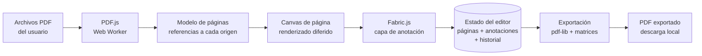

<div align="center">


# ytaPDF

**Editor de PDF que funciona íntegramente en el navegador.**

Une, reorganiza y anota documentos con texto e imágenes, y expórtalos conservando la posición exacta de cada elemento. Ningún archivo sale de tu equipo.

<br/>

[](https://svelte.dev/)
[](https://www.typescriptlang.org/)
[](https://vite.dev/)
[](https://ytapdf.vercel.app/)


-2.11-009688?style=flat-square)


<br/>

**[ytapdf.vercel.app](https://ytapdf.vercel.app/)**

<br/>

[Características](#características) &nbsp;·&nbsp;
[Uso](#uso) &nbsp;·&nbsp;
[El problema técnico](#el-problema-técnico) &nbsp;·&nbsp;
[Arquitectura](#arquitectura) &nbsp;·&nbsp;
[Desarrollo](#desarrollo) &nbsp;·&nbsp;
[Despliegue](#despliegue) &nbsp;·&nbsp;
[Limitaciones](#limitaciones-conocidas)

</div>

---

## Sobre el proyecto

Editar un PDF suele implicar subirlo a un servidor ajeno. Para un contrato, una historia clínica o una declaración de renta, eso es un problema que ninguna política de privacidad resuelve del todo.

**ytaPDF** no tiene servidor. El documento se abre, se edita y se exporta dentro del navegador: no hay carga de archivos, no hay cuenta de usuario y no hay nada que borrar después. El despliegue en Vercel sirve archivos estáticos y nada más, incluidos los recursos que PDF.js necesita para fuentes y decodificadores, de modo que abrir un documento no genera ninguna petición a terceros.

La contrapartida de trabajar sin backend es que toda la manipulación del PDF —incluido el cálculo de dónde va cada elemento en el documento final— ocurre en el cliente. La sección [El problema técnico](#el-problema-técnico) explica la parte menos evidente de eso.

<div align="center">

<br/><br/>

<br/><br/>

</div>

---

## Características

| | |
|---|---|
| **Unión de documentos** | Carga varios PDF a la vez, o añádelos después, y trabájalos como uno solo. Se pueden abrir con el botón o arrastrándolos a la ventana. |
| **Organizador visual** | Cuadrícula con arrastrar y soltar, flechas para mover páginas (útiles en pantallas táctiles y con teclado) y eliminación inmediata con opción de deshacer. |
| **Anotación con texto** | Texto de varias líneas con fuente, tamaño, color, negrita, cursiva y subrayado. El último estilo usado se aplica al siguiente texto. |
| **Inserción de imágenes** | PNG, JPG, WebP, GIF, SVG y cualquier formato que el navegador sepa leer, con escalado, rotación, volteo y opacidad. Las fotos de móvil respetan su orientación EXIF. Se pueden soltar directamente sobre una página. |
| **Historial completo** | Deshacer y rehacer cubre anotaciones, páginas añadidas, eliminadas y reordenadas (`Ctrl+Z` / `Ctrl+Y`). |
| **Exportación fiel** | Cada elemento conserva en el PDF su posición, ángulo, escala y volteo exactos, también en páginas rotadas o recortadas. |
| **Documentos protegidos** | Los PDF cifrados se abren y se exportan conservando su contenido. Si piden contraseña, la aplicación la solicita. |
| **Formularios y estructura** | Si solo se anota un documento, el original se modifica en sitio: se conservan formularios, marcadores, enlaces y metadatos. Al unir o reordenar, los campos de formulario siguen funcionando. |
| **Rendimiento** | Solo se dibujan las páginas cercanas a la vista y pdf-lib se descarga únicamente al exportar, así que los documentos largos se abren rápido. |
| **Atajos de teclado** | Las acciones habituales tienen atajo; están en la sección [Uso](#uso). |
| **Interfaz adaptativa** | Panel de páginas desplegable, barra de herramientas reorganizada y ajuste automático al ancho en pantallas pequeñas. |
| **Procesamiento local** | Ningún archivo se transmite. Si quedan cambios sin exportar, el navegador avisa antes de cerrar la pestaña. |

---

## Uso

1. **Abrir.** Pulsa *Cargar PDF* o arrastra uno o varios PDF a la ventana. Si un archivo está protegido, se pedirá su contraseña.
2. **Anotar.** Elige *Texto* y haz clic donde quieras escribir, o pulsa *Imagen* (también puedes soltar una imagen sobre la página). La fila de propiedades cambia fuente, tamaño, color, estilo, giro, volteo y opacidad de lo seleccionado.
3. **Organizar.** Desde el panel de páginas abre *Organizar páginas* para reordenarlas arrastrando o con las flechas, eliminarlas o añadir más PDF al final. Doble clic en una página vuelve a ella en el editor.
4. **Exportar.** *Exportar PDF* descarga el resultado como `<nombre>_ytaPDF.pdf`. Hasta entonces, cualquier cambio se puede deshacer.

| Atajo | Acción |
|---|---|
| `T` / `V` | Herramienta de texto / selección |
| `Supr` o `Retroceso` | Eliminar lo seleccionado |
| Flechas (`Mayús` + flechas) | Mover lo seleccionado 1 px (10 px) |
| `Esc` | Terminar la edición y deseleccionar |
| `Ctrl+Z` / `Ctrl+Y` (o `Ctrl+Mayús+Z`) | Deshacer / rehacer |
| `Ctrl +` / `Ctrl -` / `Ctrl 0` | Acercar / alejar / zoom al 100 % |
| `Ctrl` + rueda del ratón | Zoom continuo |
| `Ctrl+S` | Exportar PDF |
| `Ctrl+O` | Abrir o añadir PDF |

En macOS, `Cmd` sustituye a `Ctrl`. El porcentaje de zoom de la barra ajusta la página al ancho de la ventana.

---

## El problema técnico

Lo que hace no trivial a un editor visual de PDF es que el lienzo de edición y el documento final usan sistemas de coordenadas distintos, y hay que traducir entre ellos sin pérdida.

| | Lienzo (Fabric.js) | Documento (PDF) |
|---|---|---|
| **Origen** | Esquina superior izquierda | Esquina inferior izquierda |
| **Eje Y** | Crece hacia abajo | Crece hacia arriba |
| **Unidad** | Píxeles del viewport renderizado | Puntos tipográficos |
| **Ancla del texto** | Caja de línea, con relleno según `lineHeight` | Línea base de la fuente |
| **Rotación de página** | Ya aplicada en lo que se ve | Declarada aparte en `/Rotate` |
| **Origen de página** | Siempre en cero | Desplazado por el `CropBox` |

ytaPDF resuelve la conversión con dos matrices que ya existen, en lugar de recalcular coordenadas a mano:

1. **De objeto a lienzo:** `calcTransformMatrix()` de Fabric, la misma que usa para dibujar en pantalla. Incluye posición, ángulo, escala y volteo.
2. **De lienzo a PDF:** la inversa de `viewport.transform` de PDF.js a escala 1, la misma transformación con la que se dibujó la página. Incluye la rotación de la página, el `CropBox` y el `UserUnit`.

`src/lib/geometry.ts` compone ambas y añade un volteo del eje Y para dibujar en el espacio del PDF. El resultado se aplica con un único operador `cm` por objeto (`src/lib/export/drawing.ts`). Como las dos matrices son exactamente las que se usaron para mostrar el documento, no hay casos especiales por rotación ni errores que se acumulen.

El caso más delicado es el texto. Fabric coloca cada línea a partir de su propia métrica, mientras que el PDF dibuja desde la línea base. La exportación reconstruye los objetos con Fabric y lee de él la línea base de cada renglón:

```ts
baseline = topOffset + alturaDeRenglonesAnteriores + alturaDeLinea * (1 - _fontSizeFraction);
```

Por eso los textos de varias líneas y los subrayados coinciden con lo que se ve en pantalla. Las fuentes del lienzo son métricamente compatibles con las fuentes estándar del PDF (Arial/Liberation Sans con Helvetica, etc.), así que también coinciden los anchos.

Las pruebas de `src/lib/export/export.test.ts` lo comprueban de punta a punta: dibujan texto en páginas con rotación de 0°, 90°, 180° y 270°, con y sin `CropBox`, y verifican con PDF.js que aparece en la misma posición y dirección que en el editor.

---

## Arquitectura


```mermaid
flowchart LR
    IN["Archivos PDF<br/>del usuario"] --> JS["PDF.js<br/>Web Worker"]
    JS --> REF["Modelo de páginas<br/>referencias a cada origen"]
    REF --> CV["Canvas de página<br/>renderizado diferido"]
    CV --> FAB["Fabric.js<br/>capa de anotación"]
    FAB --> ST[("Estado del editor<br/>páginas + anotaciones<br/>+ historial")]
    ST --> EXP["Exportación<br/>pdf-lib + matrices"]
    EXP --> OUT["PDF exportado<br/>descarga local"]
```

Los archivos originales nunca se reescriben mientras se edita. El documento es una lista de **referencias a páginas** (archivo de origen e índice), y reordenar, eliminar o unir solo cambia esa lista. Cada estado del historial es una instantánea inmutable de páginas y anotaciones que comparte estructura con la anterior, así que deshacer es barato incluso en documentos grandes.

El renderizado corre en el *web worker* de PDF.js. Un `IntersectionObserver` decide qué páginas están cerca de la vista: solo esas tienen canvas e instancia de Fabric, y las demás liberan su memoria. Las anotaciones se guardan como JSON de Fabric en unidades de la página (no de pantalla), por lo que no dependen del zoom.

Al exportar se elige la estrategia que más conserva:

- **Mismo documento y mismo orden:** se modifica el original en sitio, con lo que se mantienen formularios, marcadores, enlaces, etiquetas y metadatos.
- **Páginas unidas, reordenadas o eliminadas:** se copian a un documento nuevo, que no arrastra las páginas eliminadas, y se vuelven a enlazar los campos de formulario de las páginas copiadas.

Las imágenes se guardan como URL `blob:` y el historial solo contiene esa URL. La exportación incrusta los bytes originales de cada imagen una sola vez, aunque aparezca en varios sitios.

<details>
<summary><b>Organización del código fuente</b></summary>

<br/>

```
vite.config.ts                    # Plugin que sirve y publica los recursos de PDF.js
index.html                        # Metadatos, idioma y previsualización social
public/                           # Logotipo, favicon y capturas del README
src/
├── App.svelte                    # Distribución, soltar archivos, atajos de teclado
├── main.ts                       # Punto de montaje
├── app.css                       # Variables de diseño y estilos base
└── lib/
    ├── editor.svelte.ts          # Estado global (runas), páginas, historial y operaciones
    ├── notifications.svelte.ts   # Avisos con acción («Deshacer»)
    ├── pdfjs.ts                  # Carga con contraseña y renderizado con PDF.js
    ├── fabricSetup.ts            # Controles, estilos y selección en Fabric
    ├── thumbnails.ts             # Miniaturas con caché y capa de anotaciones
    ├── images.ts                 # Importación de imágenes (formatos, EXIF)
    ├── fonts.ts                  # Familias, fuentes estándar y caracteres WinAnsi
    ├── fonts.test.ts             # Pruebas de fuentes y sustitución de caracteres
    ├── geometry.ts               # Matrices de transformación
    ├── geometry.test.ts          # Pruebas de las matrices
    ├── export/
    │   ├── index.ts              # Orquestación de la exportación
    │   ├── assemble.ts           # Documento de salida, descifrado y formularios
    │   ├── drawing.ts            # Dibujo de texto e imágenes con pdf-lib
    │   ├── fabricDrawables.ts    # Objetos de Fabric → instrucciones de dibujo
    │   └── export.test.ts        # Pruebas de exportación de punta a punta
    └── components/
        ├── Toolbar.svelte        # Herramientas, propiedades, zoom, exportación
        ├── Sidebar.svelte        # Miniaturas y navegación entre páginas
        ├── Workspace.svelte      # Área de trabajo con renderizado diferido y zoom
        ├── PdfPage.svelte        # Página: canvas de PDF.js + lienzo de Fabric
        ├── PageThumbnail.svelte  # Miniatura diferida con anotaciones
        ├── GridOrganizer.svelte  # Cuadrícula con arrastrar y soltar
        ├── Welcome.svelte        # Pantalla de inicio
        ├── Modal.svelte          # Diálogo accesible (foco atrapado, Escape)
        ├── ConfirmModal.svelte   # Confirmación de acciones destructivas
        ├── PasswordModal.svelte  # Contraseña de documentos protegidos
        └── Toasts.svelte         # Avisos
```

</details>

---

## Stack técnico

| Capa | Tecnología | Función |
|---|---|---|
| Framework | Svelte 5 | Interfaz reactiva con runas |
| Lenguaje | TypeScript 5.9 | Tipado del estado y de las transformaciones |
| Empaquetador | Vite 7 | Desarrollo, compilación y recursos locales de PDF.js |
| Lectura de PDF | PDF.js 6.3 | Interpretación y renderizado en worker |
| Escritura de PDF | @cantoo/pdf-lib 2.11 | Variante mantenida de pdf-lib con soporte de cifrado |
| Edición visual | Fabric.js 7 | Capa de objetos sobre el canvas |
| Pruebas | Vitest | Geometría, fuentes y exportación de punta a punta |
| Iconografía | lucide-svelte | Iconos de la interfaz |
| Hosting | Vercel | Sitio estático |

---

## Desarrollo

**Requisitos:** Node.js 22.13 o superior (o 24 LTS), que es lo que exigen PDF.js 6 y Vitest 5.

```bash
git clone https://github.com/juanitomanoplateada/ytaPDF.git
cd ytaPDF
npm install
npm run dev
```

Disponible en `http://localhost:5173`.

| Comando | Acción |
|---|---|
| `npm run dev` | Servidor de desarrollo |
| `npm run build` | Compilado de producción en `dist/` |
| `npm run preview` | Previsualización del compilado en `http://localhost:4173` |
| `npm run check` | Verificación de tipos con `svelte-check` y `tsc` |
| `npm test` | Pruebas con Vitest |

### Pruebas

Las pruebas corren en Node y no necesitan navegador. Cubren lo que más fácilmente se rompe sin que se note en pantalla:

- **Exportación de punta a punta** (`src/lib/export/export.test.ts`): genera PDF con pdf-lib, dibuja anotaciones y comprueba con PDF.js la posición y dirección del texto en páginas rotadas y recortadas, objetos girados y volteados, la sustitución de caracteres y que cada fuente se incruste una sola vez.
- **Ensamblado:** edición en sitio, reordenación, eliminación y unión de documentos, conservación de formularios y descifrado con y sin contraseña.
- **Fuentes y geometría:** correspondencia de familias y estilos con las fuentes estándar, juego WinAnsi y álgebra de matrices.
- **Regresión de PDF.js:** con varios documentos abiertos, cada uno mantiene su número de páginas (en PDF.js 5.4 abrir un PDF corto dejaba inaccesibles las páginas de los anteriores).

Antes de abrir un cambio conviene que pasen `npm run check`, `npm test` y `npm run build`.

### Archivos que no se versionan

El `.gitignore` deja fuera todo lo que se genera o es personal: dependencias, compilados y cachés de Vite, informes de cobertura, variables de entorno, la carpeta de Vercel, los PDF exportados durante las pruebas (`*_ytaPDF.pdf`), configuración de editores y asistentes de código, y archivos del sistema operativo.

La configuración de **SonarQube** (`sonar-project.properties` y `.scannerwork/`) también es local, porque lleva el token del servidor. Si se integra en una canalización, el token debe llegar por la variable de entorno `SONAR_TOKEN`, nunca en un archivo versionado.

---

## Despliegue

ytaPDF es un sitio estático y no necesita variables de entorno ni servidor. En Vercel basta con la configuración por defecto para Vite:

| Ajuste | Valor |
|---|---|
| Framework | Vite |
| Comando de compilación | `npm run build` |
| Directorio de salida | `dist` |
| Node.js | 22.x o 24.x |

El plugin `pdfjs-assets` de `vite.config.ts` copia en `dist/pdfjs/` las CMaps, las fuentes estándar, los decodificadores WASM y los perfiles ICC de PDF.js. Así, abrir cualquier documento solo hace peticiones al propio dominio. El código se divide en fragmentos (`pdfjs`, `fabric`, `pdf-lib`), y `pdf-lib` solo se descarga la primera vez que se exporta.

**Navegadores compatibles:** versiones recientes de Chrome, Edge, Firefox y Safari, tanto de escritorio como móviles.

---

## Limitaciones conocidas

Documentadas de forma explícita porque afectan al resultado exportado:

- **Fuentes.** La exportación usa las fuentes estándar del formato PDF —Helvetica, Times y Courier con sus variantes— que todo lector reconoce sin incrustarlas. Esto mantiene el archivo ligero y evita cuestiones de licenciamiento tipográfico, pero limita la selección a esas tres familias.
- **Juego de caracteres.** Las fuentes estándar usan codificación WinAnsi. Cubre el español completo, incluidos acentos, eñes, «comillas» y €. Los símbolos sin equivalente se sustituyen por uno legible (`→` por `->`, `≤` por `<=`, `Ł` por `L`…). Los alfabetos no latinos y los emoji se cambian por `?`, y la aplicación avisa al exportar.
- **Documentos protegidos.** Se abren con su contraseña y el PDF exportado sale **sin** protección. Conviene tenerlo en cuenta antes de compartirlo.
- **Al unir o reordenar.** El documento nuevo conserva el contenido, las anotaciones propias del PDF y los campos de formulario, pero no los marcadores ni la estructura de etiquetas del original. Si solo se anota un documento sin cambiar sus páginas, se conserva todo.
- **Edición del contenido original.** Las anotaciones se dibujan sobre el documento. El texto ya existente en el PDF no es editable ni se elimina.

---

## Hoja de ruta

- [ ] Herramienta de firma manuscrita sobre el documento
- [ ] Incrustación de fuentes personalizadas para ampliar la tipografía y el juego de caracteres
- [ ] Rotación de páginas desde el organizador
- [ ] Extracción de páginas a un documento nuevo
- [x] Metaetiquetas de descripción y previsualización social, e idioma del documento en español
- [x] Apertura de documentos protegidos mediante contraseña provista por el usuario

---

## Licencia

Pendiente de definir. Hasta entonces, todos los derechos reservados.

---

<div align="center">

<sub>Los documentos se procesan en tu navegador. No se transmiten ni se almacenan.</sub>

</div>
